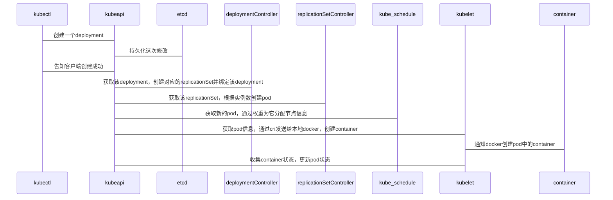
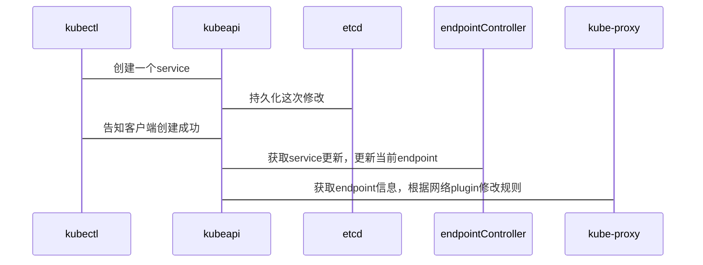

+++
Description = ""
Tags = [
  "Deployment",
  "golang",
]
Categories = [
  "开发",
]

date = "2020-04-15T18:43:37+08:00"
title = "当在k8s创建一个实体时会发生什么"
+++

### 前置条件

容器: docker

kubernetes: 1.14.2

当在k8s中创建一个deployments,注意kubeapi会通知到每一个controller，多个controll同时对一个deployment增加replicaSet只有一个会成功

<!--more-->

当k8s中创建一个service

